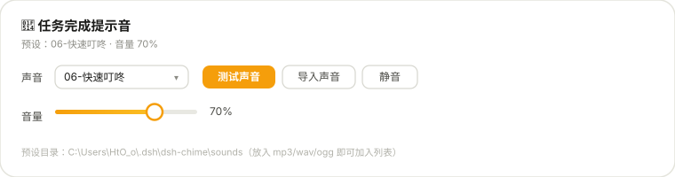
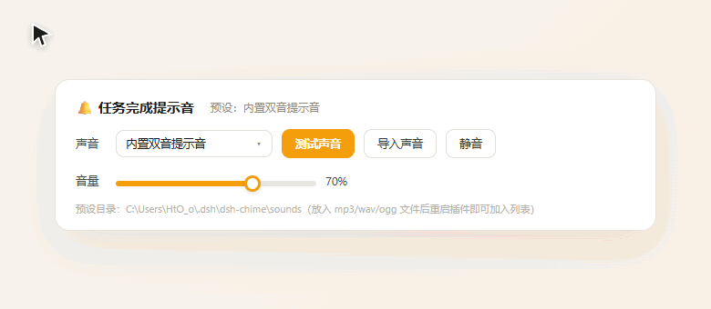
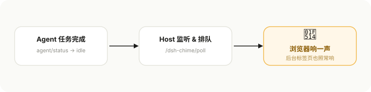

<div align="center">


[](https://www.npmjs.com/package/@hto404/dsh-chime)
[](https://www.npmjs.com/package/@hto404/dsh-chime)
[](https://github.com/HtO404/dsh-chime)
[](LICENSE)
[](https://github.com/topics/dsh-plugin)
[](https://github.com/HtO404/dsh-chime)

**DSH（DeepSeek Harness）Web GUI 的任务完成提示音插件。**

根 agent 回合结束就响一声——**页面挂在后台标签页也照常响**，你不需要盯着任务列表。

</div>

---

### 目录

[特性](#特性) · [快速开始](#快速开始) · [使用](#使用) · [工作原理](#工作原理) · [预设音效](#预设音效) · [常见问题](#常见问题) · [支持这个项目](#支持这个项目) · [Agent 安装](#agent-安装)

---

> 你发了一个 20 分钟的任务，然后切走去看视频了。
> 20 分钟后你回来：任务**早**就跑完了——而你永远不知道，它是什么时候跑完的。
>
> —— dsh-chime，就是来补上这一秒的。

---

## 特性

<table>
  <tr>
    <td width="33%" align="center"><b>⏱ 后台也响</b><br/><sub>Web Audio 播放，页面切走、标签页挂后台，照常响</sub></td>
    <td width="33%" align="center"><b>🎵 10 个精选预设</b><br/><sub>开箱即用，首次运行自动播种</sub></td>
    <td width="33%" align="center"><b>📂 自定义导入</b><br/><sub>wav / mp3 / ogg，换一个自己的声音</sub></td>
  </tr>
  <tr>
    <td width="33%" align="center"><b>🔊 音量自由</b><br/><sub>0~100% 滑杆，松手即试听</sub></td>
    <td width="33%" align="center"><b>⚙️ 一处设置，处处生效</b><br/><sub>控制面板在「设置 → 插件」，持久保存</sub></td>
    <td width="33%" align="center"><b>♻️ 重启自动拉起</b><br/><sub>随 DSH 自启；设置跨环境共享（网页端 ↔ DSH Desktop）</sub></td>
  </tr>
</table>

---

## 快速开始

### 方式一：npm 安装

```powershell
dsh plugin --profile web add @hto404/dsh-chime
```

### 方式二：本地目录

```powershell
dsh plugin --profile web add link:C:\path\to\dsh-chime
```

### 方式三：手动

把 `dsh-chime` 放进 web profile 的 `node_modules/@hto404/` 下，在 `~/.dsh/cordis.patch.yml` 追加：

```yaml
- insert:
    - id: chime
      name: '@hto404/dsh-chime'
```

然后重启 DSH（`start-dsh.bat`）。

**用 [DSH Desktop](https://github.com/anywhere-labs/deepseek-harness-desktop) 的？** 装进桌面 profile 即可：

```powershell
dsh plugin --profile desktop add @hto404/dsh-chime
```

设置由 Host 统一存储（`~/.dsh/dsh-chime/prefs.json`），**网页端与桌面端共享同一份音量 / 静音 / 所选声音**——换环境不用重新配置。

---

## 使用



**在线试玩**——直接操作控制面板：[docs/demo.html](docs/demo.html)



1. 重启 DSH 后打开 Web GUI。
2. 进入 **设置 → 插件 →「🔔 任务完成提示音」**。
3. 选预设声音、导入自定义声音、拖音量、或一键静音——全部即时生效并保存。
4. 之后任意任务跑完（哪怕页面在后台）都会响提示音。

> 首次如果没听到声音：点一次「测试声音」即可解锁浏览器的自动播放策略，之后一切正常。

---

## 工作原理



| 角色 | 做什么 |
| --- | --- |
| **Host 端** `lib/index.js` | 监听 `agent/status`，根 agent 转为 `idle` 时计入待通知队列；提供 `/dsh-chime/poll`、`/dsh-chime/presets`、`/dsh-chime/preset-audio` 三个路由 |
| **Client 端** `lib/client.js` | 浏览器每 2 秒轮询 `/dsh-chime/poll`，有完成通知就用 Web Audio 播放当前选中的声音；控制面板注册在 `settings.plugin.item` 插槽 |

**判定规则**：只响应**根 agent（主会话）**的完成——子任务（subagent）的中间完成不响。所以一个长任务里十几个子 agent 跑完也不会吵你，只有最终结果出来才报信。

---

## 预设音效

预设目录：`$DSH_HOME/dsh-chime/sounds`（默认 `~/.dsh/dsh-chime/sounds`）。首次运行自动把包内 10 个音效播种进去；想加预设，把 mp3/wav/ogg 丢进该目录，重启插件即自动出现在下拉列表。

| 预设 | 气质 |
| --- | --- |
| 01-欢快铃声 | 轻盈悦耳，像收到一条好消息 |
| 02-双声蜂鸣 | 经典电子提示，干脆不拖泥带水 |
| 03-消息弹出 | 轻巧短促，存在感刚好 |
| 04-确认音 | 沉稳肯定，任务收尾的仪式感 |
| 05-数字短音 | 利落的一声，毫不含糊 |
| 06-快速叮咚 | 清脆响亮，最不容易错过 |
| 07-气泡通知 | 活泼俏皮，有点可爱 |
| 08-清亮提示音 | 通透悠扬，适合喜欢柔和的人 |
| 09-吉他通知 | 温暖和弦，像有人在喊你 |
| 10-游戏成功 | 上扬的胜利感，任务达成！ |

内置音效来自 [Mixkit Free Sound Effects](https://mixkit.co/free-sound-effects/alerts/)，遵循 [Mixkit License](https://mixkit.co/license/)（免费可商用）。

---

## 常见问题

<details>
<summary><b>任务跑完了，为什么没有响？</b></summary>

依次检查：
1. 是否点了「静音」、音量是否被拖到了 0；
2. 该任务是否属于**子任务（subagent）**——dsh-chime 只在根 agent（主会话）完成时报信；
3. 浏览器是否拦截了自动播放——点一次「测试声音」解锁。

</details>

<details>
<summary><b>页面在后台标签页能听到吗？</b></summary>

能。Web Audio 播放不依赖页面可见性，这正是 dsh-chime 存在的意义。

</details>

<details>
<summary><b>想换自己的提示音？</b></summary>

两种方式：在设置面板点「导入声音」选本地音频；或把 mp3/wav/ogg 文件放进预设目录，重启插件后它自动出现在下拉列表里。

</details>

<details>
<summary><b>重启 DSH 后还需要手动开启吗？</b></summary>

不需要。dsh-chime 是随组合挂载的静态插件，DSH 启动即自动拉起，声音设置持久保存。

</details>

<details>
<summary><b>网页端和 DSH Desktop 之间设置会同步吗？</b></summary>

会。v0.1.2 起设置由 Host 统一存到 `~/.dsh/dsh-chime/prefs.json`（经 `/dsh-chime/prefs` 读写），音量 / 静音 / 所选声音在所有挂载该插件的环境间共享。如果旧页面仍显示默认值，刷新页面（或重启 DSH Desktop）即可。

</details>

---

## Agent 安装

想让 AI Agent 帮你一键装好这个插件？把下面的指南丢给它：

👉 **[AGENT-INSTALL.md](docs/AGENT-INSTALL.md)** —— 开头就是「Agent，看这里」，任何 Agent 照着做就能把这个项目完整装进 DSH。

---

## 支持这个项目

<div align="center">

**如果它帮你少盯了一次任务——**

点个 ⭐，让更多被 agent 遛过的人看到它。

> 工具的意义，是让你可以把注意力放回人身上。
> 盯任务列表的那双眼睛，可以歇一歇了。

</div>

---

<div align="center">

[Apache-2.0](LICENSE) · Made for [DeepSeek Harness](https://github.com/deepseek-ai/dsh) · 音效来自 [Mixkit](https://mixkit.co)

</div>
